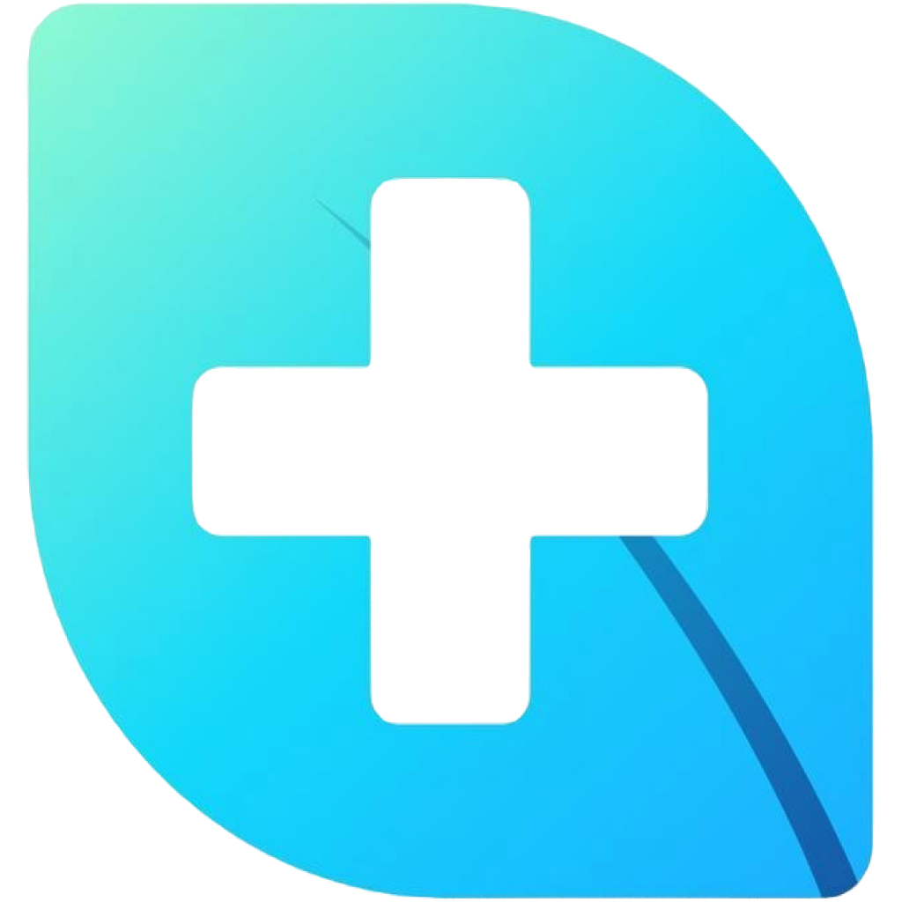
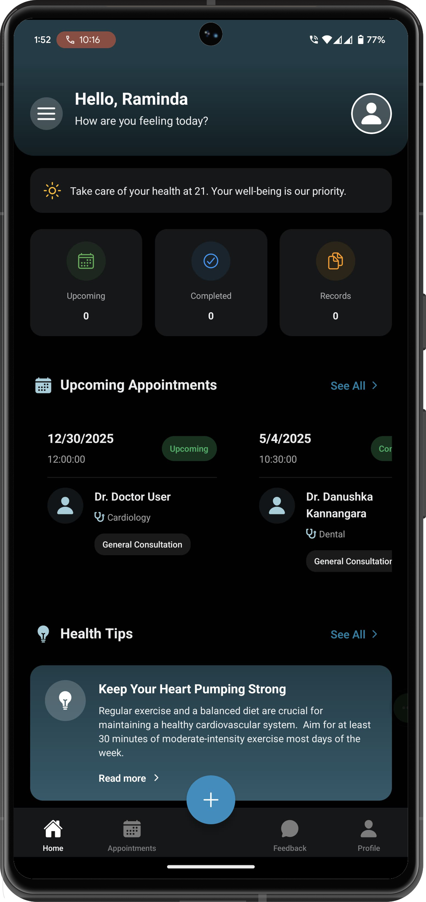

<div align="center">
  
#  Doc-Assist <span style="color: #18B3FE;">Pro</span>

### Your Modern Healthcare Assistant Solution

[](https://reactnative.dev/)
[](https://expo.dev/)
[](https://nodejs.org/)
[](https://expressjs.com/)
[](https://www.postgresql.org/)
[](https://www.docker.com/)
[](https://angular.io/)

<p align="center">
  
</p>

> Streamlining healthcare management with cutting-edge technology

</div>

<p align="center">
  <a href="#-quick-start">Quick Start</a> •
  <a href="#-docker-setup">Docker Setup</a> •
  <a href="#-project-components">Project Components</a> •
  <a href="#-local-development">Local Development</a> •
  <a href="#-mobile-apps">Mobile Apps</a> •
  <a href="#-admin-portal">Admin Portal</a> •
  <a href="#-database-management">Database</a> •
  <a href="#-troubleshooting">Troubleshooting</a>
</p>

---

## ✨ Quick Start

The entire project is containerized with Docker for easy setup and deployment. This is the recommended approach for getting started quickly:

```bash
# Clone the repository
git clone https://github.com/KADRDulmin/Doc-Assist-Pro.git

# Navigate to project directory
cd Doc-Assist-Pro

# Launch with Docker
docker-compose up -d
```

After launching, you can access:
- Patient Web App: [http://localhost:19006](http://localhost:19006)
- Doctor Web App: [http://localhost:19010](http://localhost:19010)
- Backend API: [http://localhost:3000/api](http://localhost:3000/api)
- Database Admin: [http://localhost:5050](http://localhost:5050)

> **⭐ Recommended:** While the web interfaces are fully functional, for the best mobile experience, we recommend [building and testing the mobile apps](#-mobile-apps) on physical devices or emulators.

---

## 🐳 Docker Setup

The fastest way to get Doc-Assist-Pro up and running is using Docker, which sets up the entire application stack for you with minimal configuration.

### Prerequisites

- [Docker](https://www.docker.com/get-started)
- [Docker Compose](https://docs.docker.com/compose/install/)

### Launch the Full Stack

```bash
# Build and start all containers in background
docker-compose up --build -d

# View logs (optional)
docker-compose logs -f
```

### What Gets Deployed

| Component | Description | Access URL |
|-----------|-------------|------------|
| 🖥️ Patient Frontend | React Native web interface | [http://localhost:19006](http://localhost:19006) |
| 👨‍⚕️ Doctor Portal | Doctor-specific React Native interface | [http://localhost:19010](http://localhost:19010) |
| 🔧 Admin Portal | Angular administrative interface | Needs local build for testing |
| ⚙️ Backend API | Node.js Express server | [http://localhost:3000/api](http://localhost:3000/api) |
| 🗄️ PostgreSQL | Database server | Port 5432 |
| 🔍 pgAdmin | Database management tool | [http://localhost:5050](http://localhost:5050) |

### Verify Services

Check if all services are running properly:

```bash
docker-compose ps
```

You should see `Up` status for all services.

---

## 🧩 Project Components

Doc-Assist-Pro is a comprehensive healthcare solution with the following main components:

### 📱 Patient Mobile App (Frontend)

Mobile application for patients to:
- Schedule appointments
- AI assisted doctor recommendation
- View medical records
- Receive health tips and reminders

### 👨‍⚕️ Doctor Mobile App (DAP_Doctor_Portal)

Specialized interface for doctors to:
- Manage patient appointments
- Review and update medical records
- Consultation screen
- Record prescriptions

### 🔧 Admin Portal

Web-based administrative dashboard for:
- User management
- Doctor verification
- System configuration
- Content management

### ⚙️ Backend API

Node.js/Express server that:
- Handles authentication
- Manages database operations
- Connects all frontend applications
- Implements business logic

### 🗄️ Database

PostgreSQL database storing:
- User accounts
- Medical records
- Appointment data
- System configuration

---

## 💻 Local Development

While Docker is the recommended approach for running the entire stack, you may need to develop components individually:

### Backend Setup

```bash
# Navigate to backend directory
cd backend

# Install dependencies
npm install

# Set up environment variables (copy from sample)
cp .env.example .env

# Initialize database (if needed)
npm run db:init

# Start development server
npm run dev
```

### Patient Frontend (React Native)

```bash
# Navigate to frontend directory
cd frontend

# Install dependencies
npm install

# Set up environment variables
cp .env.example .env

# Start Expo development server
npm run device
```

### Doctor Portal (React Native)

```bash
# Navigate to doctor portal directory
cd DAP_Doctor_Portal

# Install dependencies
npm install

# Set up environment variables
cp .env.example .env

# Start Expo development server
npm run device
```

### Admin Portal (Angular)

```bash
# Navigate to admin portal directory
cd admin-portal

# Install dependencies
npm install

# Start Angular development server
ng serve
```

### Environment Configuration

For local development, update your `.env` file in the backend folder:

```
# Database Configuration
PGHOST=localhost
PGUSER=postgres
PGPASSWORD=postgres
PGDATABASE=doc_assist
PGPORT=5432

# JWT Configuration
JWT_SECRET=your_secret_key_here
```

---

## 📱 Mobile Apps

Doc-Assist-Pro offers two mobile applications: the Patient App and the Doctor Portal. While they are available as web interfaces through Docker, it's **highly recommended** to build and test them on physical devices or emulators for the full experience.

### Building & Testing Mobile Apps

Both mobile apps use Expo, making it easy to test on physical devices or emulators:

#### Setting Up Development Environment

1. **Install Development Tools**:
   ```bash
   # Install required tools
   npm install -g expo-cli
   ```

2. **Android Setup**:
   ```bash
   # Run the Android SDK setup script (Windows)
   .\scripts\setup-android-sdk.bat
   ```

#### Patient App

```bash
# Navigate to frontend directory
cd frontend

# Install dependencies
npm install

# Build for Android
npm run build:android

# Build for iOS (macOS only)
npm run build:ios

# Test on Android device/emulator
npm run android

# Test on iOS simulator (macOS only)
npm run ios
```

#### Doctor Portal

```bash
# Navigate to doctor portal directory
cd DAP_Doctor_Portal

# Install dependencies
npm install

# Build for Android
npm run build:android

# Build for iOS (macOS only)
npm run build:ios

# Test on Android device/emulator
npm run android

# Test on iOS simulator (macOS only)
npm run ios
```

### Using Expo Go App

<div align="center">

</div>

For quick testing without building:

1. **Install Expo Go** on your [iOS](https://apps.apple.com/app/expo-go/id982107779) or [Android](https://play.google.com/store/apps/details?id=host.exp.exponent) device

2. **Connect to the same WiFi network** as your development computer

3. **Find your computer's IP address**:
   ```bash
   # For Windows
   ipconfig
   
   # For macOS/Linux
   ifconfig
   ```

4. **Start the development server for either app**:
   ```bash
   # For Patient App
   cd frontend
   npm run device
   
   # For Doctor Portal
   cd DAP_Doctor_Portal
   npm run device
   ```

5. **Connect using one of these methods**:
   - Scan the QR code from terminal with your device camera
   - Open Expo Go and enter: `exp://<YOUR_IP_ADDRESS>:19000` (for Patient App) or `exp://<YOUR_IP_ADDRESS>:19011` (for Doctor Portal)


For the best experience testing both applications together, use:
- Docker for backend services
- Native apps on physical devices or emulators

---

## 🔧 Admin Portal

The Admin Portal is an Angular application for system administration and management.

### Building and Running the Admin Portal

```bash
# Navigate to admin portal directory
cd admin-portal

# Install dependencies
npm install

# Start development server
ng serve
```

The admin portal will be available at [http://localhost:4200](http://localhost:4200).

### Building for Production

```bash
# Build for production
cd admin-portal
npm run build
```

### Key Features

- User account management
- Dashboard with system analytics
- Content management for health tips
- Doctor and patient profile management
- System configuration

---

---

## 🗄️ Database Management

Doc-Assist-Pro uses PostgreSQL for data storage with easy management tools.

### Database Structure

The database includes the following key tables:

- **users**: Authentication data and user profiles
- **patients**: Patient records and information
- **appointments**: Scheduling information
- **medical_records**: Patient medical history

Default test account: `test@example.com` / `test123`

### Accessing with pgAdmin


1. **Access pgAdmin** at [http://localhost:5050](http://localhost:5050)

2. **Login credentials**:
   - Email: `admin@example.com`
   - Password: `admin`

3. **Register the server**:
   - Right-click "Servers" → "Create" → "Server..."
   - Name: `Doc-Assist-DB`
   - Connection tab:
     - Host: `db` (if using Docker) or `localhost` (for local setup)
     - Port: `5432`
     - Maintenance DB: `postgres`
     - Username: `postgres`
     - Password: `postgres`

4. **Browse the database**:
   - Navigate to: Servers → Doc-Assist-DB → Databases → doc_assist → Schemas → public → Tables

### Direct Database Access

```bash
# Via Docker
docker exec -it doc-assist-pro_db_1 psql -U postgres -d doc_assist

# Local PostgreSQL client
psql -U postgres -d doc_assist
```

#### Useful PostgreSQL Commands

| Command | Description |
|---------|-------------|
| `\dt` | List all tables |
| `\d table_name` | Describe table structure |
| `\du` | List users and roles |
| `\l` | List databases |
| `\q` | Quit psql |

---

## 🔧 Troubleshooting

### Docker Issues

<details>
<summary>Container fails to start</summary>

```bash
# Check for errors in logs
docker-compose logs

# Verify ports are available
netstat -ano | findstr :3000
netstat -ano | findstr :5432
netstat -ano | findstr :19006
netstat -ano | findstr :19010

# Try rebuilding the containers
docker-compose down
docker-compose up --build
```
</details>

<details>
<summary>Database connection errors</summary>

```bash
# Check database container status
docker-compose ps db

# Run database health check
docker exec doc-assist-pro_backend_1 npm run db:check

# Verify database initialization
docker exec doc-assist-pro_db_1 psql -U postgres -c "\l"
```
</details>

### Mobile App Issues

<details>
<summary>Cannot connect from mobile device</summary>

1. Ensure your phone and computer are on the same WiFi network

2. Update your environment variables:
   ```bash
   # In frontend/.env or DAP_Doctor_Portal/.env
   EXPO_PUBLIC_LOCAL_URL=http://<YOUR_ACTUAL_IP>:19000
   EXPO_PUBLIC_API_URL=http://<YOUR_ACTUAL_IP>:3000
   ```

3. Test connectivity:
   ```bash
   # Check if API is accessible from your device's browser
   # It should show a response from the server
   http://<YOUR_ACTUAL_IP>:3000/api/health
   ```
</details>

<details>
<summary>QR Code not working</summary>

1. Make sure you're using the correct app:
   - iOS: Use the Camera app
   - Android: Use the Expo Go app

2. Try manually entering the URL:
   ```
   # For Patient App
   exp://<YOUR_IP>:19000
   
   # For Doctor Portal
   exp://<YOUR_IP>:19011
   ```

3. Check if your firewall is blocking connections

4. Try using the development build instead:
   ```bash
   # For Patient App
   cd frontend
   npm run build:android
   npm run android
   
   # For Doctor Portal
   cd DAP_Doctor_Portal
   npm run build:android
   npm run android
   ```
</details>

<details>
<summary>Build errors for mobile apps</summary>

1. Clean the project and node modules:
   ```bash
   # For either mobile app
   rm -rf node_modules
   npm cache clean --force
   npm install
   ```

2. Check Expo/React Native compatibility:
   ```bash
   npx expo-doctor
   ```

3. For Android SDK issues:
   ```bash
   # Run the setup script again
   .\scripts\setup-android-sdk.bat
   ```

4. Consider using the dockerized web version during development
</details>

### Admin Portal Issues

<details>
<summary>Angular compilation errors</summary>

```bash
# Check for TypeScript errors
cd admin-portal
npm run lint

# Try cleaning Angular cache
npm cache clean --force
rm -rf node_modules
npm install
```
</details>

---

## 📚 Additional Resources

- [Patient App Documentation](./frontend/README.md)
- [Doctor Portal Documentation](./DAP_Doctor_Portal/README.md)
- [Admin Portal Documentation](./admin-portal/README.md)
- [Backend API Documentation](./backend/README.md)
- [Expo Documentation](https://docs.expo.dev/)
- [React Native Documentation](https://reactnative.dev/docs/getting-started)
- [Angular Documentation](https://angular.io/docs)
- [PostgreSQL Documentation](https://www.postgresql.org/docs/)
- [Docker Documentation](https://docs.docker.com/)

---

<div align="center">

### 🚀 Ready to Transform Healthcare Management?

[Report Bug](https://github.com/KADRDulmin/Doc-Assist-Pro/issues) · [Request Feature](https://github.com/KADRDulmin/Doc-Assist-Pro/discussions)

</div>